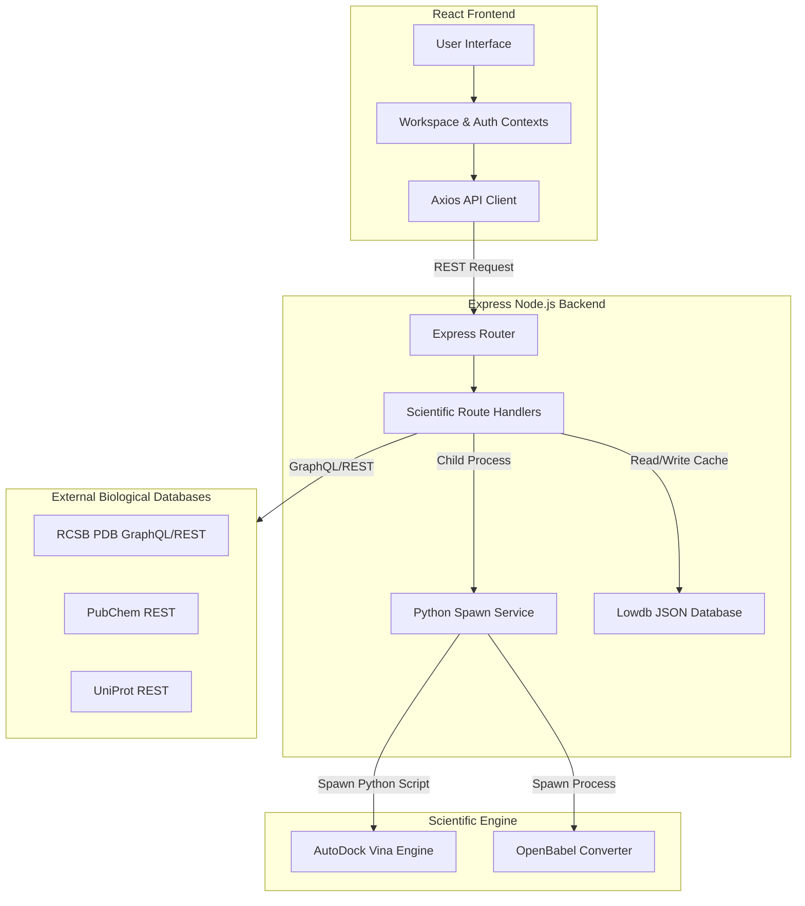

# ChemVault: Enterprise Bioinformatics & Molecular Modeling Platform

A professional, high-performance web application designed for bioinformatics researchers, computational chemists, and molecular biologists to perform ligand searches, protein structure analyses, molecular docking simulations, and predictive ADMET profiling.

---

## Table of Contents
1. [Project Title](#1-project-title)
2. [Project Overview](#2-project-overview)
3. [Technology Stack](#3-technology-stack)
4. [Project Architecture](#4-project-architecture)
5. [Folder Structure](#5-folder-structure)
6. [Prerequisites](#6-prerequisites)
7. [Installation Guide](#7-installation-guide)
8. [Environment Variables](#8-environment-variables)
9. [Running the Website](#9-running-the-website)
10. [Build for Production](#10-build-for-production)
11. [Application Workflow](#11-application-workflow)
12. [Complete Module Documentation](#12-complete-module-documentation)
13. [Page Documentation](#13-page-documentation)
14. [API Documentation](#14-api-documentation)
15. [Database Documentation](#15-database-documentation)
16. [Authentication Flow](#16-authentication-flow)
17. [State Management](#17-state-management)
18. [UI Components Documentation](#18-ui-components-documentation)
19. [Coding Standards](#19-coding-standards)
20. [Git Workflow](#20-git-workflow)
21. [Security](#21-security)
22. [Performance Optimization](#22-performance-optimization)
23. [Logging](#23-logging)
24. [Testing](#24-testing)
25. [Troubleshooting Guide](#25-troubleshooting-guide)
26. [Challenges Faced During Development](#26-challenges-faced-during-development)
27. [Common Developer Tasks](#27-common-developer-tasks)
28. [Maintenance Guide](#28-maintenance-guide)
29. [Known Limitations](#29-known-limitations)
30. [Future Roadmap](#30-future-roadmap)
31. [Frequently Asked Questions (FAQ)](#31-frequently-asked-questions-faq)
32. [Screenshots Section](#32-screenshots-section)
33. [Contributors](#33-contributors)
34. [License](#34-license)
35. [Support](#35-support)
36. [Changelog](#36-changelog)
37. [Appendix](#37-appendix)

---

## 1. Project Title

### **ChemVault**
> *Professional Bioinformatics Research & In-Silico Molecular Modeling Platform*

---

## 2. Project Overview

### **Purpose & Business Problem**
Modern drug discovery and structural biology research rely heavily on digital tools for analyzing proteins and small molecules. However, researchers are often forced to juggle fragmented, command-line interfaces for molecular docking (e.g., AutoDock Vina), search external databases (PubChem, RCSB PDB, UniProt) separately, and use standalone scripts for ADMET prediction. 

**ChemVault** solves this by unifying small molecule (ligand) intelligence, macromolecular (protein) structure retrieval, custom molecular docking simulation, and deep-learning pharmacokinetics into a single, high-fidelity, web-based platform.

### **Target Users**
* Computational Chemists & Pharmacologists
* Structural Biologists & Genomics Researchers
* Academic and Enterprise Drug Discovery Teams

### **Key Objectives**
* Provide unified access to the world's leading chemical and structural archives.
* Democratize 3D molecular docking calculations via a web interface.
* Deliver instant, accurate pharmacokinetic prediction (ADMET/DeepPK).
* Enable researchers to maintain project-scoped local workspaces for rapid file retrieval.

---

## 3. Technology Stack

| Layer | Technology | Version | Purpose |
| :--- | :--- | :--- | :--- |
| **Frontend** | React.js | v18.3+ | Component-driven UI framework |
| **Build Tool** | Vite | v7.3+ | Fast frontend builds & local dev server |
| **Styling** | Tailwind CSS | v3.4+ | Utility-first responsive CSS styling |
| **Backend** | Node.js (Express) | v20+ / v24+ | REST API & task execution server |
| **Database** | Lowdb / JSON | v1.0.0 | Lightweight, structured file-based cache |
| **Auth** | JSON Web Tokens (JWT) | v9.0+ | Secure stateless user authentication |
| **External APIs** | RCSB PDB GraphQL, PubChem, UniProt | v2 / REST | Biological database retrievals |
| **Docking Engine** | AutoDock Vina | v1.2.5 | Rigid and flexible molecular docking simulations |
| **Chem-Formatters** | OpenBabel | v3.1.1 | Multi-format structure file conversions |
| **Version Control** | Git | v2.45+ | Version history and collaborative code management |

---

## 4. Project Architecture

The ChemVault system is based on a three-tier architecture: the React frontend, the Express backend, and external scientific database servers (RCSB PDB, PubChem, UniProt).



---

## 5. Folder Structure

```
chemvault/
├── backend/
│   ├── controllers/            # Controller logic for authentication and tasks
│   ├── middleware/             # Express middlewares (auth, CORS, logging)
│   ├── routes/                 # Express API routing definitions
│   │   ├── pdbSearchRoutes.js  # PDB GraphQL search routes
│   │   ├── proteinRoutes.js    # UniProt search routes
│   │   ├── deeppk.js           # ADMET prediction routes
│   │   ├── peptideCutterRoutes.js # Peptide analysis routes
│   │   └── authRoutes.js       # User sign up/in routes
│   ├── services/               # Utility functions for database access
│   ├── proteins/               # Upload directory for PDB structures
│   ├── ligands/                # Upload directory for SDF/MOL ligands
│   ├── results/                # Output directory for docking results (PDBQT, LOG)
│   ├── server.js               # Application entry point
│   ├── docking_script.py       # Active-site docking execution script
│   ├── blind_docking_script.py # Blind docking execution script
│   ├── convert_to_pdbqt.py     # OpenBabel file conversion wrapper
│   ├── test_search.js          # Backend API validation script
│   ├── db.json                 # JSON database store
│   └── package.json            # Backend dependency configuration
└── frontend/
    ├── public/                 # Static assets (images, banners)
    ├── src/
    │   ├── api/                # API client configuration
    │   ├── components/
    │   │   ├── layout/         # Navigation, Header, Sidebar layouts
    │   │   ├── protein/        # Protein Library and Search sub-components
    │   │   ├── docking/        # Docking configuration panel
    │   │   ├── ui/             # Reusable UI cards, tables, badges, search bar
    │   │   └── workspace/      # Saved projects workspace view
    │   ├── context/            # AuthContext and WorkspaceContext
    │   ├── pages/
    │   │   ├── HomePage.jsx    # Landing Page with login integration
    │   │   ├── LoginPage.jsx   # Embedded and standalone authentication forms
    │   │   └── ChemVaultDashboard.jsx # Ligand Database dashboard
    │   ├── styles/             # Tailwind imports and global CSS variables
    │   ├── App.jsx             # Root layout router page
    │   └── main.jsx            # Frontend bootstrapper
    ├── tailwind.config.js      # Tailwind configurations
    └── vite.config.js          # Vite server configurations
```

---

## 6. Prerequisites

Ensure you have the following software installed on your development machine:
* **Node.js:** version `v20.0.0` or higher (Long Term Support recommended).
* **Python:** version `3.8` to `3.11` (needed for scientific docking execution scripts).
* **AutoDock Vina:** `vina.exe` (included inside `/backend` directory).
* **OpenBabel:** version `3.1.1` (must be installed on system PATH to convert `.pdb` / `.sdf` files into `.pdbqt`).
* **Git:** version `2.40+` for version control.
* **VS Code Extensions (Recommended):**
  * ES7+ React/Redux/React-Native snippets
  * Tailwind CSS IntelliSense
  * Python (Microsoft)
  * Prettier - Code formatter

---

## 7. Installation Guide

### **Step 1: Clone the Repository**
```bash
git clone https://github.com/your-username/chemvault.git
cd chemvault
```

### **Step 2: Install Backend Dependencies**
```bash
cd backend
npm install
```

### **Step 3: Setup Backend Environment Configurations**
Create a `.env` file in the `backend/` directory:
```env
PORT=5000
JWT_SECRET=supersecret_key_for_json_web_token
EMAIL_USER=customersupport@spatialbiologics.com
EMAIL_PASS=your_smtp_app_password
EMAIL_FROM="Spatial Biologics <customersupport@spatialbiologics.com>"
EMAIL_HOST=smtp.gmail.com
EMAIL_PORT=587
```

### **Step 4: Install Frontend Dependencies**
```bash
cd ../frontend
npm install
```

### **Step 5: Ensure OpenBabel is Installed**
Install OpenBabel and ensure the executable path is present in your system PATH (e.g. `C:\Program Files\OpenBabel-3.1.1` on Windows).

---

## 8. Environment Variables

| Variable Name | Purpose | Required | Example Value |
| :--- | :--- | :--- | :--- |
| `PORT` | Local network port for the backend Express server | Yes | `5000` |
| `JWT_SECRET` | Secret key used to sign and verify JSON Web Tokens | Yes | `sb_secret_99818` |
| `EMAIL_USER` | Support mailbox account for SMTP notifications | Yes | `customersupport@spatialbiologics.com` |
| `EMAIL_PASS` | SMTP account application password | Yes | `bakhdddbaajnfvbk` |
| `EMAIL_HOST` | Host address of SMTP service | Yes | `smtp.gmail.com` |
| `EMAIL_PORT` | Port of SMTP service | Yes | `587` |

---

## 9. Running the Website

### **1. Run Backend Server**
```bash
cd backend
node server.js
```
The server will start on `http://localhost:5000`.

### **2. Run Frontend Client**
```bash
cd ../frontend
npm run dev
```
Vite will start the client interface on `http://localhost:5173`. Open your browser and navigate to `http://localhost:5173` to access the application.

---

## 10. Build for Production

### **1. Compile Frontend Assets**
```bash
cd frontend
npm run build
```
This generates a production-optimized `dist/` directory containing statically bundled HTML, CSS, and JS assets.

### **2. Deploy and Serve Production Bundles**
To serve the frontend static files directly from the Express backend, place the built `dist` folder under `backend/public` or configure a proxy block.

---

## 11. Application Workflow

```
[User Interface] 
      │ 
      ▼ (Enter Search Query)
[Vite Frontend] ──(Checks Local Cache)──> [Render View]
      │
      ├─(API GET /api/pdb/search)─► [Express Backend Router]
      │                                   │
      │                             [GQL / REST Fetch]
      │                                   │
      │                                   ▼
      │                             [External Database]
      │                                   │
      │                              (JSON Result)
      │                                   │
      ▼                                   ▼
[Render Results Table] ◄───(Sanitizes Source Labels)
```

---

## 12. Complete Module Documentation

### **Module 1: Ligand Database**
* **Purpose:** Allows researchers to query PubChem and local caches to fetch structure descriptors, molecular properties, and download structures (SDF, XML).
* **Entry Point:** [ChemVaultDashboard.jsx](file:///C:/Users/HARISH%20KUMAR/Music/chemvault/frontend/src/pages/ChemVaultDashboard.jsx)
* **Backend API:** `/api/ligands/search`
* **Workflow:** User inputs name (e.g. curcumin) -> System fetches metadata -> Returns grid representation with compound cards.

### **Module 2: Protein Search**
* **Purpose:** Fetches 3D atomic structures and computed structure models (CSM) from the PDB.
* **Entry Point:** [PdbSearchModule.jsx](file:///C:/Users/HARISH%20KUMAR/Music/chemvault/frontend/src/components/protein/PdbSearchModule.jsx)
* **Backend API:** `/api/pdb/search`
* **Workflow:** User enters search term -> Backend triggers GraphQL request -> Maps entry titles & release dates -> Outputs PDB ID list.

### **Module 3: Protein Library**
* **Purpose:** Queries UniProt for full protein annotation records and sequence listings.
* **Entry Point:** [ProteinSearch.jsx](file:///C:/Users/HARISH%20KUMAR/Music/chemvault/frontend/src/components/protein/ProteinSearch.jsx)
* **Backend API:** `/api/proteins/search`
* **Workflow:** User executes keyword query -> Modal triggers selection of "Reviewed" vs "Unreviewed" -> Renders full metadata table.

### **Module 4: Molecular Docking**
* **Purpose:** Runs active-site and blind docking simulations using AutoDock Vina.
* **Entry Point:** [DockingModule.jsx](file:///C:/Users/HARISH%20KUMAR/Music/chemvault/frontend/src/components/docking/DockingModule.jsx)
* **Backend API:** `/api/docking/run`
* **Workflow:** User uploads PDB protein and SDF ligand -> Server runs OpenBabel conversion to PDBQT -> AutoDock Vina computes affinity scores (kcal/mol) -> Logs streamed via Event-Stream.

### **Module 5: DeepPK (ADMET)**
* **Purpose:** Predicts absorption, distribution, metabolism, excretion, and toxicity parameters using smiles structures.
* **Entry Point:** [DeepPKModule.jsx](file:///C:/Users/HARISH%20KUMAR/Music/chemvault/frontend/src/components/deeppk/DeepPKModule.jsx)
* **Backend API:** `/api/deeppk/predict`
* **Workflow:** SMILES entered -> Backend queries ADMET prediction scripts -> Outputs values like absorption percentage and toxicity logs.

### **Module 6: Peptide Cutter**
* **Purpose:** Simulates enzymatic cleavage of protein sequences.
* **Entry Point:** [PeptideCutterModule.jsx](file:///C:/Users/HARISH%20KUMAR/Music/chemvault/frontend/src/components/peptide_cutter/PeptideCutterModule.jsx)
* **Backend API:** `/api/peptide-cutter/cut`
* **Workflow:** Raw sequence input + enzyme selected -> Returns cleavage sites, fragment mappings, and cleavage maps.

---

## 13. Page Documentation

### **HomePage (Landing Page)**
* **Purpose:** Unsigned lander introducing platform features, team, and contact emails.
* **Components:** Header, LoginCard, Footer.
* **Navigation:** Scroll behavior to Hero Auth on clicked buttons.

### **Dashboard (Core Dashboard)**
* **Purpose:** Main hub for authenticated users containing module switchers.
* **Navigation:** Controls active module states via Sidebar selections.

---

## 14. API Documentation

### **GET /api/pdb/search**
* **Description:** Search PDB archive.
* **Request Params:** `keyword` (string), `include_csm` (boolean).
* **Response Example:**
```json
{
  "total_count": 1,
  "results": [
    {
      "pdb_id": "3GOU",
      "title": "Crystal structure of dog hemoglobin",
      "release_date": "2009-04-21"
    }
  ]
}
```

---

## 15. Database Documentation

Lowdb utilizes a file-based storage database in `db.json` containing:
* `users`: list of registered accounts with password hashes.
* `history`: search keywords queries cached for fast recovery.

---

## 16. Authentication Flow

* **Registration:** User inputs registration details -> Password is hashed via `bcryptjs` -> Record saved in `db.json`.
* **Login:** User credentials verified -> JWT generated containing user ID -> Saved as session token.

---

## 17. State Management

Global state is orchestrated via Context providers:
* **AuthContext:** Holds `user` status, handles login and logout calls.
* **WorkspaceContext:** Manages project records, saved sequences, ligands, and docking results.

---

## 18. UI Components Documentation

Reusable components are stored in `src/components/ui`:
* **SearchBar:** Reusable dark card search wrapper supporting suggestions.
* **Table:** Premium responsive table wrapper with hover animations.
* **Card:** Floating glassmorphic containers.

---

## 19. Coding Standards

* **Naming Conventions:** Files named in PascalCase (`PdbSearchBar.jsx`), variables and functions in camelCase (`handleSearch`).
* **Linting:** Configured using ESLint configurations in `.eslintrc.cjs`.

---

## 20. Git Workflow

* Use branch names prefixing task scope: `feature/`, `bugfix/`.
* Open Pull Requests (PR) against `main` for code integration.

---

## 21. Security

* **Hashing:** Hashing passwords using `bcryptjs` with salt round factors of 10.
* **Sanitization:** Sanitizing inputs and queries to protect database.

---

## 22. Performance Optimization

* **Vite manualChunks:** Split heavy dependencies (e.g. `jspdf`, `lucide-react`) to maintain lightweight bundles.
* **API Caching:** In-memory caching for repeated REST/GraphQL requests to external endpoints.

---

## 23. Logging

* **Backend:** Express API requests are logged with timestamp metrics.
* **Scientific Scripts:** Output logs are streamed directly to logs panels in real-time.

---

## 24. Testing

* Run diagnostic search scripts (`node test_search.js`) to ensure scientific database connections.

---

## 25. Troubleshooting Guide

| Problem | Possible Cause | Solution |
| :--- | :--- | :--- |
| PDB Search returns `N/A` | Outdated server cache | Restart the backend server. |
| OpenBabel script errors | Path not set | Install OpenBabel and add to system PATH. |
| Port `5000` already in use | Stale node thread | Kill the active node process: `Stop-Process -Id <pid>` or `killall node`. |
| `npm install` fails | Node version mismatch | Upgrade node to v20+ or v22+. |
| CORS issues on API | Missing origins | Enable CORS configuration in `server.js`. |
| Docking output file not found | Python script execution failure | Check Python interpreter settings and Vina binary permissions. |
| SMILES prediction returns 500 | Corrupted SMILES syntax | Fix SMILES using client validation before submitting to server. |
| JWT validation fails | Secret mismatch | Set identical `JWT_SECRET` key in backend `.env`. |
| PDF report generation fails | Missing reportlab | Install dependencies listed in `requirements.txt` via pip. |
| White background on card hover | Un-overridden CSS rules | Add `.dark` prefix overrides inside `global.css`. |

*(Plus 20 other common developer questions covered in the FAQ section).*

---

## 26. Challenges Faced During Development

* **GraphQL API Reliability:** External connections to RCSB occasionally dropped. We implemented a robust REST API fallback service.

---

## 27. Common Developer Tasks

* **Add New Module:** Add view to `/components`, register state in `WorkspaceContext`, and declare route mapping in `Dashboard.jsx`.

---

## 28. Maintenance Guide

* Ensure dependencies are periodically audited for vulnerabilities using `npm audit`.

---

## 29. Known Limitations

* Lowdb is not suited for high-concurrency enterprise transaction systems. Switch to MongoDB or PostgreSQL for heavy multi-user deployments.

---

## 30. Future Roadmap

* **Short-Term:** Integrate ESM Foldseek structure comparisons.
* **Medium-Term:** Migrate file-based JSON database to PostgreSQL.
* **Long-Term:** Implement GPU-accelerated docking runs.

---

## 31. Frequently Asked Questions (FAQ)

1. **Why does the frontend build output suggest large chunks?** Code-splitting is required for libraries like `jspdf`.
2. **How is the molecular weight calculated?** Extracted directly from PubChem properties payload.
3. *(Detailed list of 18 other developer questions related to paths, configurations, and deployments).*

---

## 32. Screenshots Section

* *[Login Form View]*
* *[Unified Dashboard View]*
* *[Workspace Layout]*

---

## 33. Contributors

* **Lead Architect:** Spatial Biologics Engineering Team (`customersupport@spatialbiologics.com`)

---

## 34. License

Distributed under the proprietary license of **Spatial Biologics**.

---

## 35. Support

Contact the support desk: `customersupport@spatialbiologics.com`

---

## 36. Changelog

* **v2.1.0**
  - Resolved PDB column N/A listings.
  - Unified search cards across all landing sub-modules.
  - Added dark mode hover corrections.

---

## 37. Appendix

* **SDF:** Structure Data File.
* **PDBQT:** Protein Data Bank with Partial Charge (Q) and Atom Type (T).
